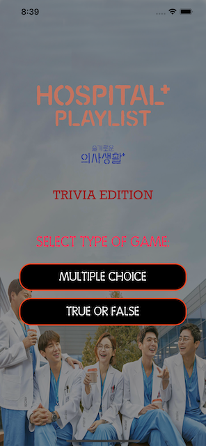
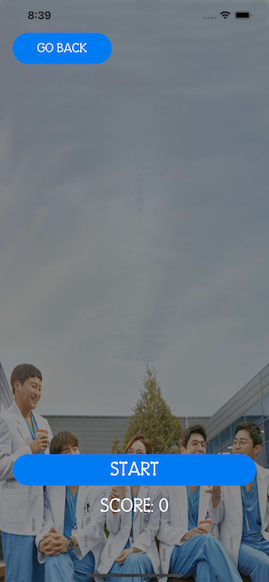
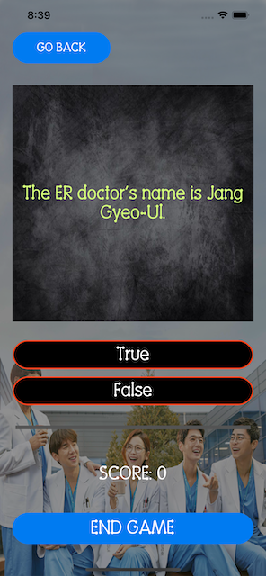
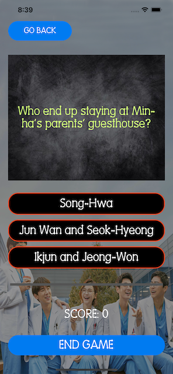

# Quizzler-IOS

## Project Description

A trivia application that tests your knowledge about the K-Drama series, Hospital Playlist. This application was built to test our knowledge of the following modules:

	- Design Pattern (MVC)
	- Swift Structures and Functions With Outputs
	- Object Oriented Programming
	- UIAlertController (To Display Pop-Ups For User)
	- Object Initialization
	- How To Programmatically Change UI Elements Such As Labels and Views

## Features

1. Multiple Choice Quiz
2. True Or False Quiz

## Technologies Used

1. XCode 13 - IDE
2. Swift 5 - Programming Language
3. UIKit - Interface Builder

## Sample Look

<h3>Home Page</h3>

<h3>Start Page</h3>

<h3>True Or False</h3>

<h3>Multiple Choice</h3>

## Credits

App Background

	- https://www.pinterest.com/pin/761178774517389412/

App Icon

	- <a href="https://www.flaticon.com/free-icons/quiz" title="quiz icons">Quiz icons created by Freepik - Flaticon</a>

How To Use Fill Proportionally

	- https://stackoverflow.com/questions/48931958/fill-proportionally-in-uistackview (User Gihan's answer)	

## Note

This is a companion project to The App Brewery's Complete App Development Bootcamp, check out the full course at [www.appbrewery.co](https://www.appbrewery.co/)

